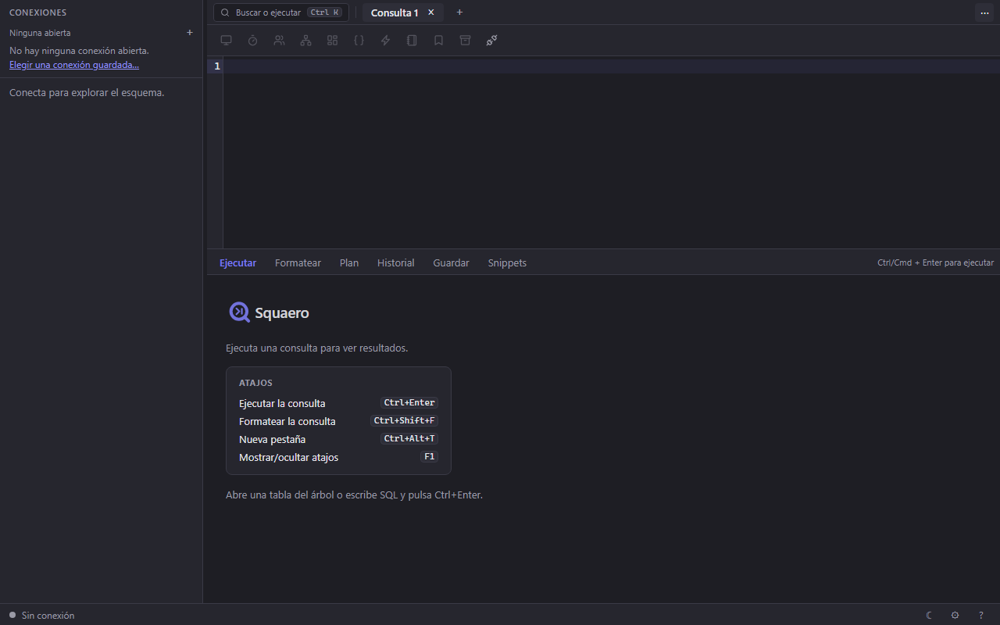

<p align="center">
  
</p>

<p align="center">
  <em>A modern, lightweight, multi-engine database client — an open-source alternative in the spirit of Navicat.</em>
</p>

<p align="center">
  <b>English</b> · <a href="README.es.md">Español</a>
</p>

<p align="center">
  <a href="https://github.com/danielnuld/squaero/releases"></a>
  <a href="LICENSE"></a>
  
</p>

**Squaero** (Latin *quaero*, "I seek / I inquire") is a multi-engine database
client with a **C core** (`libdbcore`) and a **web UI running on the OS-native
webview** (WebView2 on Windows, WebKitGTK on Linux, WKWebView on macOS). A modern
UI without the weight of Electron, and a native engine that talks directly to
each database's client libraries.

## Supported engines

| Engine | Status |
|---|---|
| **SQLite** | ✅ Complete (verified) |
| **PostgreSQL** | ✅ Via libpq — SSL/TLS, SCRAM |
| **MySQL / MariaDB** | ✅ Complete (verified) — SSL/TLS, SSH tunnel |
| **Informix** | ✅ Via ODBC (x86 build) |
| **MongoDB** | ✅ Read (find/aggregate, mongosh syntax) |
| SQL Server, Oracle | ⏳ Planned (M12) |

Engines load as **plugins** (`.dll`/`.so`) implementing a C contract: adding an
engine never touches the core. See [how to write a driver](docs/WRITING_A_DRIVER.md).

## Features

**SQL editor**
- CodeMirror editor with **schema-aware autocomplete**, SQL **formatting**, and
  run **selection / statement / document**.
- Query **history** with per-query duration and slow-query marks.
- **Snippets / favorites**; **command palette** (Ctrl/Cmd+K).
- **Visual execution plan** (EXPLAIN) as a tree.

**Result grid**
- Virtualized, per-column **sort and filter**, real **pagination** (offset).
- Inline **transactional editing** (insert/update/delete + SQL preview +
  commit/rollback); **row detail** (form view).
- **Export** CSV / JSON / SQL / XML / HTML / **XLSX**; **import** CSV / JSON / XLSX.
- **Charts** (bar / line / pie).

**Objects and design**
- Lazy, virtualized object tree **grouped by type** (tables, views, procedures,
  functions, triggers, events).
- **Table designer** (create and ALTER), **index and constraint editor**.
- **Procedures / functions**, **triggers / events**, **users and privileges**.
- **Server monitor** (process list + kill), **slow queries**.
- **ER diagram** (real foreign keys from the engine) and a **visual query builder**.

**Data across connections**
- Schema and data **sync**, table **transfer** between connections, and test
  **data generation**.

**Connectivity and platform**
- **SSH tunnel** (all engines), **SSL/TLS** (MySQL, PostgreSQL), and
  **import/export** of saved connections — including **DBeaver**'s
  `data-sources.json` (with the `credentials-config.json` beside it) and
  **Navicat**'s `.ncx`, **passwords and all**, so moving in does not start with
  retyping thirty servers.
- **Light/dark** theme with the indigo brand, **Settings** and **About** panels,
  **keyboard shortcuts**, adaptive context menus.
- **Single executable** (embedded UI) + drivers as plugins. No Electron.

<p align="center">
  
</p>

## Install

**Windows:** download the latest `.msi` installer from
[**Releases**](https://github.com/danielnuld/squaero/releases) and run it. Requires
the **WebView2** runtime (already bundled in Windows 11). Every release attaches a
`SHA256SUMS.txt` to verify the download:
`sha256sum -c SHA256SUMS.txt` (or `CertUtil -hashfile squaero-*.msi SHA256`).
Releases from v0.26.0 on also carry a signed build-provenance attestation, which
proves the MSI was built by this repository's release workflow:
`gh attestation verify squaero-X.Y.Z-x86.msi --repo danielnuld/squaero`.
The MSI is not Authenticode-signed yet, so Windows SmartScreen shows an unknown
publisher; signing through SignPath Foundation is being set up — see the
[code signing policy](https://danielnuld.github.io/squaero/code-signing-policy/).

**Informix** needs IBM's **32-bit Informix Client SDK**, which the installer does
not include: install it from IBM
([where to download](https://www.ibm.com/support/pages/where-download-informix-client-sdk)).
Squaero tells you when a connection finds no client.

> Linux (AppImage/deb) and macOS (.app) are coming in future releases.

## Build from source

Requirements: **CMake ≥ 3.20**, a C11 compiler (GCC/Clang/MSVC) and, recommended,
**Ninja**; **Node + pnpm** for the UI.

```bash
# UI (produces frontend/dist/index.html, a single file that gets embedded)
pnpm --dir frontend install
pnpm --dir frontend build

# Core + app
cmake -S . -B build -G Ninja
cmake --build build
ctest --test-dir build --output-on-failure   # core tests
```

The binary lands in `build/app/quaero` (`.exe` on Windows). **Webview
dependencies**: Linux `libgtk-4-dev libwebkitgtk-6.0-dev`; macOS system WebKit;
Windows WebView2 (downloaded at build time). Core only: `-DQUAERO_BUILD_APP=OFF`.

**PostgreSQL:** the driver links `libpq`. On x64 it uses a system libpq; the x86
release build compiles a static libpq from source with `-DQUAERO_LIBPQ=ON`.

**MongoDB:** the driver links `libmongoc`. Without a system copy, build it from
source with `-DQUAERO_MONGOC=ON` (fetches and statically links mongo-c-driver;
TLS via Secure Channel on Windows).

**Windows MSI installer:** see [`installer/build-msi.sh`](installer/build-msi.sh)
(WiX v5 via `dotnet tool`). Releases are cut automatically on a version tag — see
[docs/VERSIONING.md](docs/VERSIONING.md).

**Per-engine smoke:** `scripts/smoke/run.sh <sqlite|mysql|mongodb>` — see
[docs/QA-SMOKE.md](docs/QA-SMOKE.md).

## Architecture

```
Frontend (OS webview)  ──JSON IPC──>  C core (libdbcore)  ──vtable──>  Drivers (plugins)
   SolidJS UI, virtual grid,           connection, queries,             sqlite, postgres,
   SQL editor, tools                   introspection, editing, tx       mysql, informix, mongodb, …
```

Details in [`docs/ARCHITECTURE.md`](docs/ARCHITECTURE.md).

## Documentation

- [ROADMAP](ROADMAP.md) · [Architecture](docs/ARCHITECTURE.md)
- [Driver contract](docs/DRIVER_API.md) · [How to write a driver](docs/WRITING_A_DRIVER.md)
- [IPC protocol](docs/IPC.md) · [Shortcuts](docs/SHORTCUTS.md) · [Versioning](docs/VERSIONING.md)
- [Verification matrix](docs/QA-MATRIX.md) · [Brand](assets/brand/BRAND.md)
- [Contributing](CONTRIBUTING.md)

## License

[GPLv3](LICENSE). Proprietary-engine drivers ship as separate plugins, loaded at
runtime, to respect their licenses. Full third-party inventory in
[THIRD-PARTY.md](THIRD-PARTY.md).
